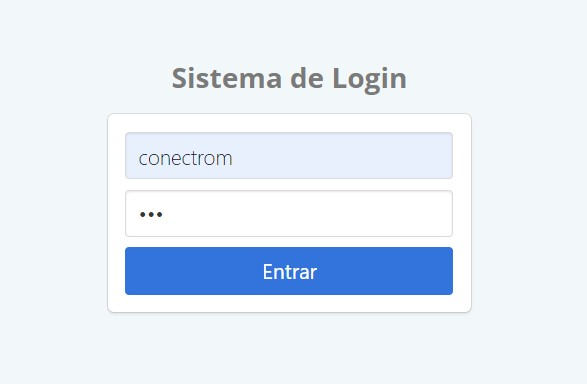
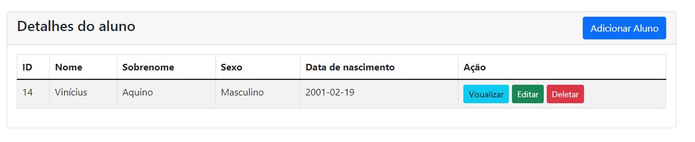
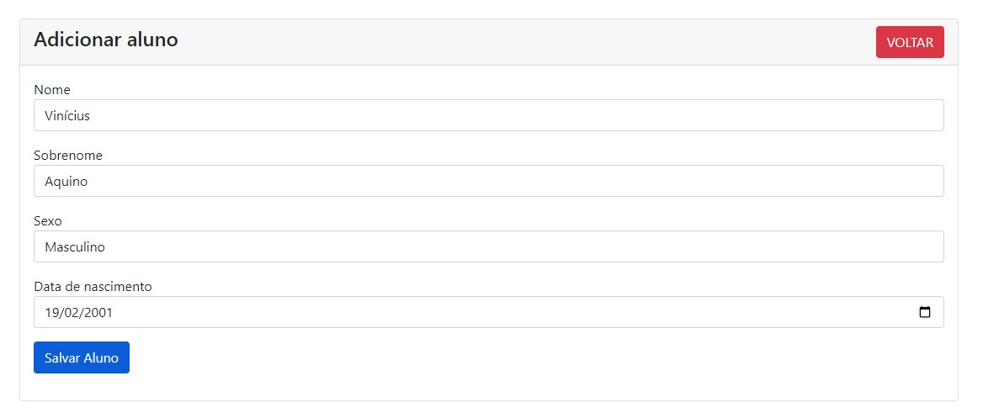

<h1 align="center">:file_cabinet: Projeto Conectrom</h1>

## :memo: Descrição
Projeto para Conectrom que tem, como finalidade fundamental, um teste prático avaliativo de conhecimento técnico conforme as necessidades da empresa.

## :books: Funcionalidades
* <b>Funcionalidade 1</b>: Sistema de autenticação do usuário, composta de login e senha fixa já registrada no banco de dados. Ao preencher corretamente, a aplicação redireciona para uma segunda página a qual ele tem permissões para modifica-la.
* <b>Funcionalidade 2</b>: Oferece ao usuário autenticado a possibilidade para criar e gerenciar elementos de dados persistentes ao interagir com os dados em um servidor por meio de uma tabela responsiva com interface fácil de entender e manusear.

## :wrench: Tecnologias utilizadas
* Bootstrap, PHP e Mysql

## :rocket: Rodando o projeto
Para rodar o repositório é necessário cloná-lo à pasta onde está rodando o servidor interno ou externo e, em seguida, sequenciar e registrar em linha o banco de dados com a seguinte regra em linguagem SQL:
```sql
CREATE DATABASE crud-conectrom;

USE crud-conectrom;

CREATE TABLE usuario (
  `usuario_id` INT NOT NULL AUTO_INCREMENT,
  `usuario` VARCHAR(200) NOT NULL,
  `senha` VARCHAR(32) NOT NULL,
  PRIMARY KEY (`usuario_id`));

INSERT INTO `usuario` (`usuario`,`senha`) VALUES ('conectrom','dd4c6a9aba64625b07c323281e3ccbe2');

CREATE TABLE students (
    id INT(6) AUTO_INCREMENT PRIMARY KEY,
    name VARCHAR(191) NOT NULL,
    sobrenome VARCHAR(191) NOT NULL,
    sexo VARCHAR(191) NOT NULL,
    data_nascimento DATE,
)
```
Após esse proceso, o usuário consegue fazer login e testar as funcionalidades presentes.
> Usuário: conectrom

> Senha: 123

## :eyes: Demonstração





## :handshake: Desenvolvedor
<table>
  <tr>
    <td align="center">
      <a href="http://github.com/vinnyaquino">
        <br>
        <sub>
          <b>Vinícius Aquino</b>
        </sub>
      </a>
    </td>
  </tr>
</table>

## :dart: Status do projeto
Funcionando
